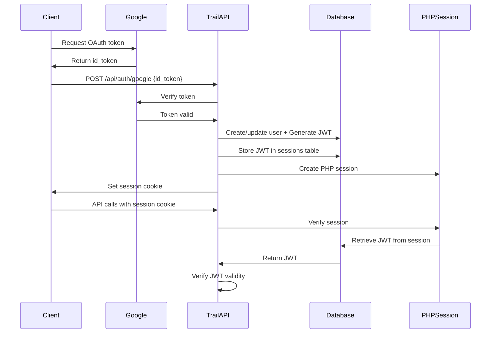

# Trail - Link Journaling Service

Multi-user link journaling API service with Google OAuth authentication, media uploads, and social engagement features.

## Overview

Trail is a production-ready API service that enables users to create, share, and engage with short-form content entries (140 characters) with optional media attachments and automatic URL preview enrichment.

### Key Features

- **Google OAuth 2.0 Authentication** - Secure user authentication
- **API Token System** - Persistent, user-owned tokens for programmatic access
- **Link Journaling** - 140-character posts with automatic URL previews
- **Media Upload** - Image attachments up to 20MB with WebP optimization
- **Full-Text Search** - Fast search with relevance ranking
- **Social Engagement** - Claps and threaded comments
- **RSS Feeds** - Global and per-user feeds
- **Real-time Notifications** - Mentions and engagement updates
- **Moderation Tools** - User muting and content reporting

## Architecture

### Tech Stack

- **Backend:** PHP 8.4+ with Slim Framework
- **Database:** MariaDB/MySQL
- **Authentication:** Google OAuth 2.0 + JWT + API Tokens
- **URL Enrichment:** Iframely API
- **Image Processing:** GD Library with WebP support

### Authentication System

Trail uses a dual authentication system:

1. **API Tokens** (Recommended for API clients)
   - Persistent, user-owned tokens
   - Never expire (until regenerated)
   - Managed from user profile page
   - Used with `Authorization: Bearer <token>` header

2. **Session-based JWT** (Web browsers)
   - Automatic session management
   - Auto-refreshed every 18 hours
   - Stored in database with PHP sessions

## Internal: Google OAuth 2.0 Flow

This section documents the internal authentication flow for developers working on the Trail backend.

### Authentication Flow Diagram



### Google OAuth Endpoint

**Endpoint:** `POST /api/auth/google`

**Request:**
```json
{
  "id_token": "GOOGLE_ID_TOKEN_FROM_OAUTH_FLOW"
}
```

**Server Process:**
1. Verifies Google `id_token` using Google's token verification API
2. Extracts user information (email, name, photo)
3. Creates or updates user in `trail_users` table
4. Generates JWT token with 7-day expiration
5. Stores JWT in `trail_sessions` table
6. Creates PHP session
7. Sets secure, httpOnly session cookie (`trail_session`)

**Response:**
```json
{
  "jwt": "eyJ0eXAiOiJKV1QiLCJhbGc...",
  "user": {
    "id": 123,
    "email": "user@example.com",
    "name": "John Doe",
    "nickname": "johndoe",
    "is_admin": false
  }
}
```

**Cookie Set:**
- Name: `trail_session`
- Value: 64-character session ID
- Attributes: `httpOnly`, `secure`, `SameSite=Lax`
- Expiration: 1 year

### Session & JWT Lifecycle

**JWT Properties:**
- **Algorithm:** HS256
- **Expiration:** 7 days (168 hours)
- **Storage:** `trail_sessions.jwt_token` column
- **Refresh:** Auto-refreshed after 18 hours (sliding window)

**Session Properties:**
- **Session ID:** 64-character random hex string
- **Storage:** `trail_sessions` table
- **Expiration:** 1 year
- **Cookie:** httpOnly, secure, SameSite=Lax

### Authentication Middleware

**File:** `backend/src/Middleware/AuthMiddleware.php`

**Authentication Priority:**
1. **API Token** (from `Authorization: Bearer` header)
   - Queries `trail_users.api_token`
   - No expiration, no refresh
   - Direct user lookup

2. **Session JWT** (from session cookie)
   - Validates session cookie
   - Retrieves JWT from `trail_sessions` table
   - Verifies JWT signature and expiration
   - Auto-refreshes if older than 18 hours

**User Attributes Set:**
- `user_id` - User's database ID
- `email` - User's email address
- `is_admin` - Admin flag (boolean)

### Database Schema

**Users Table (`trail_users`):**
```sql
CREATE TABLE trail_users (
  id INT UNSIGNED PRIMARY KEY AUTO_INCREMENT,
  google_id VARCHAR(255) UNIQUE NOT NULL,
  email VARCHAR(255) NOT NULL,
  name VARCHAR(255),
  nickname VARCHAR(50) UNIQUE,
  bio VARCHAR(160),
  gravatar_hash VARCHAR(64),
  photo_url TEXT,
  profile_image_id INT UNSIGNED,
  header_image_id INT UNSIGNED,
  api_token VARCHAR(64) UNIQUE NOT NULL,
  api_token_created_at TIMESTAMP,
  is_admin BOOLEAN DEFAULT FALSE,
  created_at TIMESTAMP DEFAULT CURRENT_TIMESTAMP,
  updated_at TIMESTAMP DEFAULT CURRENT_TIMESTAMP ON UPDATE CURRENT_TIMESTAMP,
  INDEX idx_email (email),
  INDEX idx_google_id (google_id),
  INDEX idx_nickname (nickname),
  INDEX idx_api_token (api_token)
);
```

**Sessions Table (`trail_sessions`):**
```sql
CREATE TABLE trail_sessions (
  id INT UNSIGNED PRIMARY KEY AUTO_INCREMENT,
  session_id VARCHAR(64) UNIQUE NOT NULL,
  user_id INT UNSIGNED NOT NULL,
  email VARCHAR(255) NOT NULL,
  photo_url TEXT,
  is_admin BOOLEAN DEFAULT FALSE,
  jwt_token TEXT,
  expires_at TIMESTAMP NOT NULL,
  created_at TIMESTAMP DEFAULT CURRENT_TIMESTAMP,
  FOREIGN KEY (user_id) REFERENCES trail_users(id) ON DELETE CASCADE,
  INDEX idx_session_id (session_id),
  INDEX idx_expires_at (expires_at),
  INDEX idx_user_id (user_id)
);
```

### Security Features

**Token Security:**
- API tokens: 256 bits of entropy using `random_bytes(32)`
- JWT secret: 256-bit secret key (configured in `secrets.yml`)
- Session IDs: 64-character random hex strings

**HTTP Security:**
- HTTPS enforced (secure cookies)
- CORS middleware with configurable origins
- CSRF protection for state-changing operations
- XSS prevention via content sanitization
- SQL injection prevention via prepared statements

**Rate Limiting:**
- Authentication: 5 attempts per 5 minutes
- General API: 180 requests per minute
- Hourly limit: 3000 requests per hour
- Response: HTTP 429 when exceeded

## Development

### Prerequisites

- PHP 8.4+
- Composer
- MariaDB/MySQL
- Google OAuth credentials

### Setup

1. Clone the repository
2. Install dependencies:
   ```bash
   cd backend
   composer install
   ```

3. Configure `backend/secrets.yml`:
   ```yaml
   google_oauth:
     client_id: YOUR_CLIENT_ID
     client_secret: YOUR_CLIENT_SECRET
     redirect_uri: https://your-domain.com/admin/callback.php
   
   jwt:
     secret: YOUR_256_BIT_SECRET
     expiry_hours: 168
   
   database:
     host: localhost
     port: 3306
     name: trail_db
     user: trail_user
     password: YOUR_PASSWORD
   ```

4. Run database migrations:
   ```bash
   ./sync.sh
   ```

### Deployment

Deploy to production using the sync script:

```bash
./sync.sh
```

This script:
1. Installs Composer dependencies
2. Uploads files via FTP
3. Runs pending database migrations
4. Verifies deployment

## API Documentation

Full API documentation is available at: https://trail.services.kibotu.net/api

### Public API Access

View and search public content without authentication:

```bash
# List all public entries
curl https://trail.services.kibotu.net/api/entries

# Search entries
curl https://trail.services.kibotu.net/api/entries?q=example

# Get specific entry
curl https://trail.services.kibotu.net/api/entries/123

# Get user's entries
curl https://trail.services.kibotu.net/api/users/johndoe/entries

# Search user's entries
curl https://trail.services.kibotu.net/api/users/johndoe/entries?q=example

# Get comments on an entry
curl https://trail.services.kibotu.net/api/entries/123/comments
```

### Authenticated API Access

For creating and modifying content:

1. Sign in at https://trail.services.kibotu.net
2. Get your API token from your profile page
3. Use the token in API requests:

```bash
# Create an entry
curl -X POST \
     -H "Authorization: Bearer YOUR_API_TOKEN" \
     -H "Content-Type: application/json" \
     -d '{"text": "Hello world!"}' \
     https://trail.services.kibotu.net/api/entries

# Add a clap
curl -X POST \
     -H "Authorization: Bearer YOUR_API_TOKEN" \
     https://trail.services.kibotu.net/api/entries/123/claps
```

## Project Structure

```
trail/
├── backend/
│   ├── public/              # Web root
│   │   ├── index.php        # Main API router
│   │   ├── api-docs.php     # API documentation
│   │   ├── js/              # Frontend JavaScript
│   │   ├── assets/          # CSS, fonts, images
│   │   └── helpers/         # Helper functions
│   ├── src/
│   │   ├── Controllers/     # API controllers
│   │   ├── Middleware/      # Authentication, CORS, etc.
│   │   ├── Models/          # Database models
│   │   ├── Services/        # Business logic (JWT, Google Auth)
│   │   ├── Config/          # Configuration loader
│   │   └── Database/        # Database connection
│   ├── templates/           # HTML templates
│   ├── vendor/              # Composer dependencies
│   └── secrets.yml          # Configuration (not in git)
├── migrations/              # Database migrations
├── android/                 # Android app
└── sync.sh                  # Deployment script
```

## Contributing

This is a private project. For questions or issues, contact the maintainer.

## License

Proprietary - All rights reserved.
