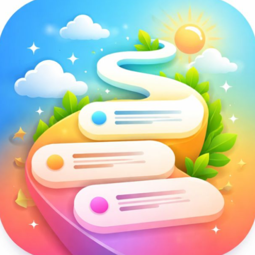

<p align="center">
  
</p>

<h1 align="center">Trail for Android</h1>

<p align="center">
  Native Android client for <a href="https://github.com/kibotu/trail">Trail</a> — the self-hosted micro link journal for people who miss chronological feeds.
  <br /><br />
  Kotlin, Jetpack Compose, Material 3. One activity, no fragments, no DI framework. Refreshingly simple for what it does.
</p>

<p align="center">
  <a href="https://play.google.com/store/apps/details?id=net.kibotu.trail">
    
  </a>
</p>

## Screenshots

<p align="center">
  
  
  
  
  
  
</p>

## Features

### Share from anywhere

The killer feature. Select text in any app → Share → Trail. Done. Your link is posted with a URL preview card before you even switch apps. Works pre-login too — entries queue up until you authenticate. It's the fastest path from "I found something interesting" to "it's on my timeline."

### Rich media

- **Images, GIFs, video** — Full inline playback with Coil and ExoPlayer. One video plays at a time (because autoplay chaos is what we left behind).
- **Fullscreen viewer** — Pinch-to-zoom, double-tap zoom, pan, swipe-to-dismiss. The image viewing experience you'd expect from a native app.
- **Chunked image upload** — Pick up to 3 images/videos, compressed and uploaded in 512KB chunks with progress tracking. Your 15MB photo won't time out.
- **URL preview cards** — Paste a link, get a rich card with title, description, image, and site name. Powered by Iframely.

### Feeds & discovery

- **Dual feeds** — Global chronological timeline for everyone, personal `/@username` feed for just your stuff
- **Full-text search** — Debounced search overlay with infinite scroll. Type, find, done.
- **Tags** — Browse and filter entries by tag

### Social

- **Claps** — 1-50 per entry or comment. Show appreciation with granularity.
- **Threaded comments** — With their own clap counts, media attachments, and reporting
- **@mentions** — Tag users, they get notified
- **User profiles** — Browse anyone's profile, see their stats, entries, and top posts
- **User muting** — Hide content from users you'd rather not see
- **Content reporting** — Flag entries and comments for review

### Notifications

- **In-app notifications** — Mentions, claps, comments, all in one screen
- **Unread badge** — On the tab bar, so you know when something happened
- **Mark read / delete** — Manage individually or mark all read

### Your data, your call

- **Data export** — Download all your data as HTML. GDPR-compliant, human-readable.
- **Account deletion** — Request deletion with a grace period. Changed your mind? Revert it.
- **Copy profile link** — Share your `/@username` URL anywhere

### Authentication

- **Google Sign-In** — Via Credential Manager API (the modern way). One tap, JWT issued, done.
- **Auto-login** — Tokens persisted in encrypted DataStore. Restart the app, you're still signed in.
- **Deletion blocker** — If your account is pending deletion, you get a clear screen to revert or log out. No silent failures.

### Polish

- **Material 3** — Light and dark themes, persisted across restarts
- **App Links** — Tap a Trail URL, open the app. Deep linking with `autoVerify`.
- **Chrome Custom Tabs** — External URLs open in a Custom Tab, not a random browser intent
- **In-app review** — Prompts via Play Core with a 7-day cooldown (max 3 prompts total, we're not that app)
- **In-app updates** — Flexible updates via Play Core so you're always current
- **Baseline profiles** — Pre-compiled hot paths for faster cold starts and less jank
- **Predictive back** — Supports the Android 14+ predictive back gesture
- **Animated splash** — Heartbeat animation on launch because why not
- **Crashlytics + Analytics** — Firebase for crash reporting and usage analytics

## Architecture

Single-activity Compose app with feature-based packaging. MVVM with dedicated ViewModels per screen, `StateFlow` for reactive UI state, and `PagingData` for infinite scroll.

No DI framework — manual wiring through `TrailApp`. Simple enough that you don't need Dagger, small enough that you won't miss it.

| Layer | Approach |
|-------|----------|
| **UI** | Jetpack Compose, Material 3, feature-based screens |
| **State** | Per-screen ViewModels with `StateFlow` + `PagingData` |
| **Network** | Ktor Client with kotlinx-serialization |
| **Storage** | DataStore Preferences (tokens, theme, review/update state) |
| **Media** | Coil 3 (images/GIFs), Media3 ExoPlayer (video) |
| **Navigation** | Navigation Compose with typed routes |
| **Auth** | Credential Manager → Google ID → JWT |

### ViewModels

`AuthViewModel`, `HomeViewModel`, `MyFeedViewModel`, `ProfileViewModel`, `UserProfileViewModel`, `EntryDetailViewModel`, `SearchViewModel`, `NotificationsViewModel` — each owns its screen's state and talks to shared repositories.

### Shared layer

Repositories (`EntryRepository`, `CommentRepository`, `ProfileRepository`, `AuthRepository`, `UserRepository`, `NotificationRepository`, `ImageUploadRepository`), managers (`ImageUploadManager`, `InAppReviewManager`, `InAppUpdateManager`), and reusable UI components live in `shared/`.

## Stack

| Category | Library |
|----------|---------|
| Language | Kotlin |
| UI | Jetpack Compose (BOM), Material 3 |
| Network | Ktor Client |
| Serialization | kotlinx-serialization |
| Images | Coil 3 (+ GIF support) |
| Video | Media3 ExoPlayer |
| Auth | Credential Manager |
| Storage | DataStore Preferences |
| Navigation | Navigation Compose |
| Pagination | Paging 3 |
| Crash reporting | Firebase Crashlytics + Analytics |
| In-app review | Play Core Review |
| In-app update | Play Core Update |
| External URLs | AndroidX Browser (Custom Tabs) |
| Icons | Font Awesome Compose |
| Blur effects | Haze |
| Logging | Timber |
| Performance | Baseline Profiles, Profile Installer |
| Leak detection | Plumber (debug only) |

Versions intentionally omitted — they go stale fast. See [`gradle/libs.versions.toml`](gradle/libs.versions.toml) for the current truth.

## Prerequisites

- **Android Studio** Ladybug+ (or command-line SDK tools)
- **JDK 17**
- **Google Cloud project** with OAuth 2.0 Web Client ID

## Configure

Create `local.properties` in this directory:

```properties
# Required: Your backend URL
API_BASE_URL=https://your-trail-instance.example.com/

# Debug signing
DEBUG_KEYSTORE_PATH=certificates/debug.jks
DEBUG_STORE_PASSWORD=your_password
DEBUG_KEYSTORE_ALIAS=debug
DEBUG_KEY_PASSWORD=your_password

# Release signing
RELEASE_KEYSTORE_PATH=certificates/release.jks
RELEASE_STORE_PASSWORD=your_password
RELEASE_KEYSTORE_ALIAS=release
RELEASE_KEY_PASSWORD=your_password
```

Also update `app/src/main/res/values/strings.xml` → `default_web_client_id` with your Google OAuth Web Client ID from Cloud Console → Credentials.

Generate keystores if you don't have them:

```bash
keytool -genkey -v -keystore certificates/debug.jks \
  -alias debug -keyalg RSA -keysize 2048 -validity 10000
```

## Build & Install

```bash
cd android

# Debug
./gradlew assembleDebug
./gradlew installDebug

# Release (minified, R8)
./gradlew assembleRelease

# App bundle for Play Store
./gradlew bundleRelease

# Release with specific version
VERSION=1.2.3 && ./gradlew bundleRelease \
  -PversionName=$VERSION \
  -PversionCode=$(($(echo $VERSION | awk -F. '{print $1*10000000+$2*100000+$3*1000}')))
```

APKs land in `app/build/outputs/apk/`, bundles in `app/build/outputs/bundle/`.

Self-hosters: you can distribute APKs directly — no Play Store required. Consider [Obtainium](https://github.com/ImranR98/Obtainium) for update management.

## Security

- **HTTPS only** — `networkSecurityConfig` blocks cleartext. No exceptions.
- **JWT auth** — Bearer token on all authenticated requests, auto-refresh on 401
- **Encrypted storage** — Tokens persisted in DataStore (encrypted SharedPreferences under the hood)
- **R8/ProGuard** — Release builds are minified and obfuscated
- **No backup** — `allowBackup=false` prevents token extraction via adb
- **FileProvider** — Secure file sharing for intents

## API

The app talks to these backend endpoint groups:

| Category | What |
|----------|------|
| **Auth** | Google Sign-In, session management |
| **Entries** | CRUD, claps, views, reporting, tags |
| **Comments** | CRUD, claps, reporting, media |
| **Profiles** | View, edit, export, deletion, revert |
| **Users** | Public profiles, muting, view tracking |
| **Notifications** | List, read, delete, preferences |
| **Media** | Chunked upload (init → chunk → complete) |
| **Filters** | Muted users |

Full endpoint documentation: https://trail.services.kibotu.net/api

## License

Apache 2.0 — see root [LICENSE](../LICENSE).
